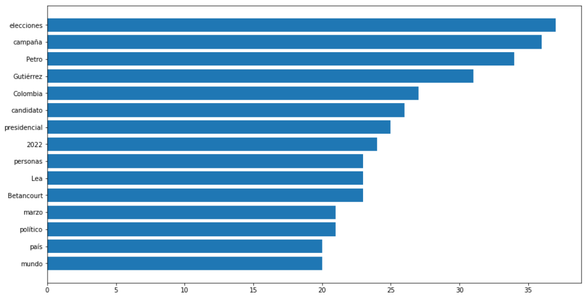
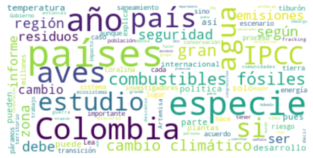

# Web-Scrapping and NLP Analysis (Workshop 2)

## Members:
- León Vargas Boris Nicolas
- Losada Ordoñez Mateo Alejandro

## Youtube Video:
- https://youtu.be/bw_i9_Z24XA

## High-level functionality

- This code uses an algorith with PySpark implementing web-scrapping in the website of "EL ESPECTADOR" to apply Natural Languaje Processing (NLP) to the content of the news founded in different pages using 5 different categories (politics, technology, environment, health, education).

- We made a fork of the repo to start the process and made some changes to the "default" code, implementing functions seen in the last sessions.

- First there is the process of web scrapping in which we made the same process of searching news depending on the category, so we used a time limit of 2 weeks and collected data from all the news in this last 2 weeks like the title, the author and the content of the new. After that we saved that data in  MongoDB as independant registers.

- After that, we read the data base and started the NLP based on the different categories, so we filtered the news saved on the data base by category and made all the process of word tokenization, word distribution avoiding the stop words in spanish to finally build the graph and plot of each distribution.

- Also you can see some of the evidences of the news saved on the database and the plots and diagrams in the directoy of 'evidences' like this:

## News saved on the MongoDB Database

## Bargraph of the politics catagory

## Wordcloud of the environment catagory

- On the other hand, there are some evidences that can be seen inside the project, so please run the project with the following steps:

#### Instructions

+ Clone this repository
+ Open a command line console and go inside the repo's directory and run the command "jupyter lab"

+ Run each code block (you need to have the mongoDB service running) to the end. 
+ There are the graphics and the results of the program.
